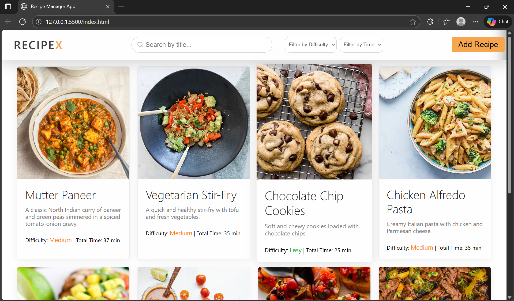
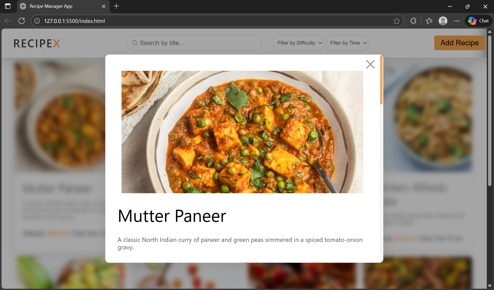
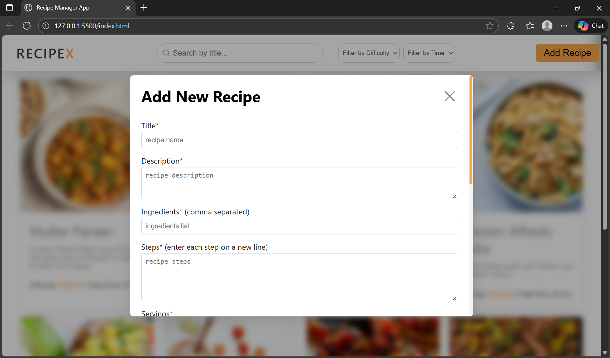
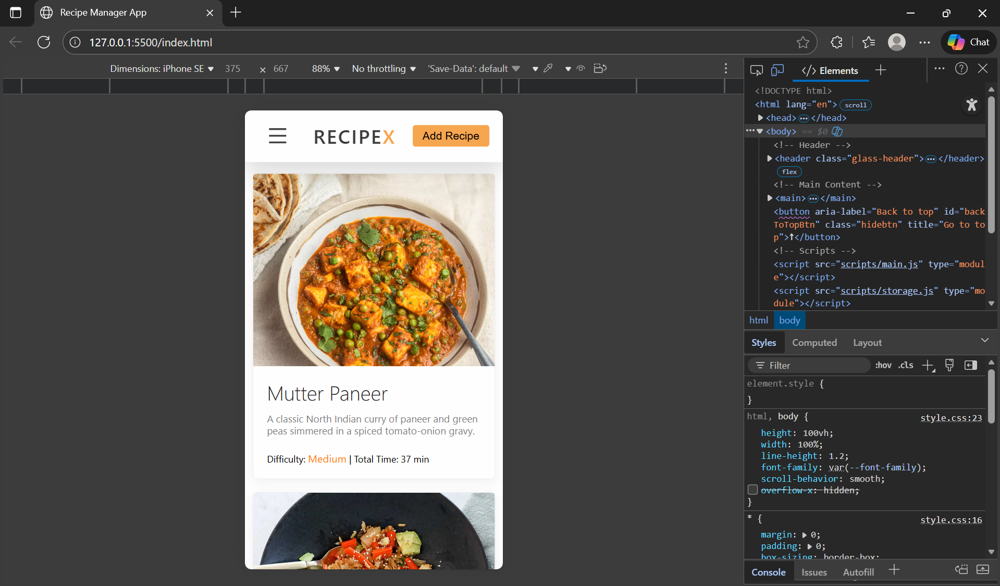

# 🍳 Recipe Manager Web App

The **Recipe Manager App** is a simple project designed to help users store, organize, and browse their favorite recipes. This is the initial version of the project, and additional features will be added as development progresses.

---

## **Deployment**

- **Status:** Deployed to GitHub Pages
- **URL:** https://gauravprajapati03.github.io/Recipe-Manager/


---

## 🧭 Project Overview

The goal of this application is to provide a clean and intuitive way to manage recipes. Planned features include:

- ➕ Adding new recipes  
- 📂 Viewing saved recipes  in a grid layout (Home page) with recipe cards
- 🪟 See detailed recipe information with full ingredients, steps, optional image and additional information.
- 🔎 Searching for recipes  
- 🏷️ Filtering recipes based on difficulty and Time Required
- ✏️ Editing and deleting existing recipes via a form
- 📱 Responsive design ensures usability on desktop and mobile devices.
- 📈 Persist recipe data entirely on the client using localStorage (no backend needed).

This README will be expanded as the project evolves.

---

## 🖼️ Screenshots

#### 👉 Homepage (Desktop) View
<p align="center">
  
</p>

#### 👉 View Recipe Detail
<p align="center">
  
</p>

#### 👉 Add Recipe Form
<p align="center">
  
</p>

#### 👉Responsive (Mobile) View
<p align="center">
  
</p>

---

## 🚀 Features 
- Add, Edit, Delete recipes with structured form and automatic validation.
- View recipe grid with searchable, filterable cards (by title, difficulty, total time).
- Detail modal: See full recipe, ingredients, steps, servings, tags, cuisine, notes, and more.
- Responsive design: Looks and works great on desktop, tablet, and mobile screens.
- LocalStorage persistence: All data is stored in your browser and preserved on reload.
- Accessibly designed: Keyboard-friendly, labels included, and clear error messages.
- Back To Top button implemented on homepage
- Light/Dark mode toggle for better user experience

---

## 🌐 Responsive Layout

- Header displays navigation, add button, and collapses to a hamburger menu on mobile.

- Recipe cards stack and resize for better readability on small screens.

- All forms/modals are fully accessible and scrollable.

---

## 🚀 Getting Started

These simple steps will help you run the app locally or view it online:

1. **Click the deployed link to view the live website:** https://gauravprajapati03.github.io/Recipe-Manager/
2. Clone or download this repository.
3. Open the `index.html` file in any modern browser (Chrome, Firefox, Edge).
4. The app will initialize with a default recipe stored in your localStorage on first load.
5. Start adding, editing, and managing your recipes instantly!

> Note: No server or build tools required — purely static client-side app.


---

## 📝 How To Use the App

1. **Viewing Recipes**
    - On first load, the app displays a grid of sample recipes.
    - Click any recipe card to open its detail view (modal).
    - In the detail, you'll see:
      - Title, description
      - Servings, prep/cook/total times
      - Cuisine type, tags, notes
      - Full ingredients and step-by-step instructions
    <br>
2. **Searching & Filtering**
    - Use the search box to filter recipes by title instantly.
    - Use dropdowns to filter by:
      - Difficulty (Easy, Medium, Hard)
      - Total time
    <br>
3. **Adding a New Recipe** 
    - Click the **Add Recipe** button.
    - Fill in all required fields:
      - **Title:** 3–100 chars
      - **Description:** 10–500 chars
      - **Ingredients:** Comma-separated OR one per line, at least 1
      - **Steps:** One per line, at least 1
      - **Prep/Cook/Total Time:** Positive integers
      - **Servings:** Positive integer, e.g. 2–50
      - **Difficulty:** Easy / Medium / Hard
    - Optionally add:
      - **Image URL:** Must be a valid http/https link
      - **Tags:** Comma-separated, e.g. "Vegetarian, Curry"
      - **Cuisine:** e.g. "Indian"
      - **Notes:** Any notes/tips, max 500 chars
    - Invalid inputs will show red error messages and highlight fields.
  <br>
4. **Editing Existing Recipes**
    - In the recipe detail view, click Edit.
    - Update any fields and save.
    - Validation works the same as for adding new recipes.
  <br>
5. **Deleting Recipes**
    - In the recipe detail view, click Delete.
    - Confirm deletion—this cannot be undone.


---

## 📁 Project Structure

```plaintext
recipe-manager/
├── index.html
├── styles/
│   └── style.css
├── scripts/
│   ├── main.js
│   ├── storage.js
│   ├── ui.js 
│   ├── validation.js
│   └── recipeData.js
└── assets/
    └── (optional images/icons)
``` 

---

## 💾 Data Structure in localStorage

- All recipes are stored under the key `"recipes"`.
- Data is stored as a JSON stringified array of recipe objects.
- Each recipe object contains:

```
{
    "id": "unique-string-id",
    "title": "Recipe Title",
    "description": "Short description",
    "ingredients": ["Ingredient 1", "Ingredient 2", "..."],
    "steps": ["Step 1", "Step 2", "..."],
    "servings": number,

    "prepTime": number,        // in minutes
    "cookTime": number,        // in minutes
    "totalTime": number,       // in minutes (calculated or manual)
    "difficulty": "Easy|Medium|Hard",
    "imageURL": "https://... (optional image link)",

    "tags": ["Tag1", "Tag2", "..."],      // e.g., ["Breakfast", "Sweet"]
    "cuisine": "Cuisine Name",            // e.g., "American"
    "notes": "Optional notes about the recipe",

    "createdAt": "ISO timestamp",
    "updatedAt": "ISO timestamp"
}
```

# Recipe JSON Schema Example

This is an example JSON object structure for a recipe, including all common and extended fields useful for documentation and implementation.

```
{
    id: "3924867287",
    title: "Classic Pancakes",
    description: "Fluffy and delicious pancakes to start your day.",
    ingredients: [
      "2 cups all-purpose flour",
      "2 large eggs",
      // ...
    ],
    steps: [
        "Mix dry ingredients in a large bowl.",
        // ...
    ],
    servings: 4,
    totalTime: 15,
    prepTime: 10,
    cookTime: 5,
    difficulty: "Easy",
    imageURL: "https://cdn.dummyjson.com/recipe-images/3webp",
    tags: ["Breakfast", "Sweet"],
    cuisine: "American",
    notes: "Try adding blueberries for extra flavor!",
    createdAt: "2025-11-21T10:30:00Z",
    updatedAt: "2025-11-21T10:45:00Z"
      
    author: "Your Name",                     // for future use
    rating: 4.5,                             // for future use
    nutrition: { calories: 220, protein: 6, carbs: 32, fat:7 },     // for future use
    isFavorite: false,                       // for future use
    }
    // more recipes
```


## Field Descriptions

- **id**: Unique identifier for the recipe (string).
- **title**: Name/title of the recipe (string).
- **description**: Short description/introduction to the recipe (string).
- **ingredients**: Array of ingredient descriptions (array of strings).
- **steps**: Array of step-by-step instructions (array of strings).
- **servings**: Number of servings produced by the recipe (number).
- **prepTime**: Preparation time in minutes (number, optional).
- **cookTime**: Cooking time in minutes (number, optional).
- **totalTime**: Total time in minutes (prepTime + cookTime) (number).
- **difficulty**: Difficulty level ("Easy" | "Medium" | "Hard").
- **imageURL**: URL to an image of the prepared dish (string).
- **tags**: Array of tags/categories (array of strings).
- **cuisine**: Cuisine type, e.g., "Italian", "Indian" (string).
- **createdAt**: Creation timestamp or date string.
- **updatedAt**: Last updated timestamp or date string.
- **notes**: Additional cook's notes or tips (string, optional).
  <br>
- **ratings**: Rating between (1 - 5)   // for future
- **author**: Author or creator of the recipe (string, optional).   // for future
- **isFavorite**: Boolean to mark as favorite (true/false).  // for future
- **nutrition**: Nutrition facts with calories, proteins, carbs, and fats (numbers, optional).  // for future


---

## ✅ Recipe Validation Rules

Each recipe must follow these validation requirements:

### 📌 Title
- **Required**
- Minimum: **3 characters**
- Maximum: **~100 characters**

### 📝 Description
- **Required**
- Minimum: **10 characters**
- Maximum: **~500 characters**

### 🥗 Ingredients
- **Required**
- Must contain **at least 1 ingredient**
- Accepted formats:
  - Comma-separated list  
  - One ingredient per line
- Trim whitespace from each ingredient

### 🍳 Steps
- **Required**
- Must contain **at least 1 step**
- Steps entered **one per line**
- Trim whitespace from each step

### ⏱️ Time Fields (Prep / Cook / Total)
- **All required**
- Must be **positive integers**

### 🥣 Servings

- **Required**

- Must be a **positive integer**
- No fractions, zero, or negative values
- Recommended range: **1–50**

### 🏷️ Tags

- **Optional**

- If provided:
  - Split by comma or whitespace
  - Trim whitespace from each tag
  - Each tag must be ≥ 2 characters
  - Each tag must be ≤ 18–25 characters
  - No duplicate tags (case-insensitive)
  
  - Allowed characters:
    - Letters
    - Number
    - Space
    - Hyphens (-)
    - Underscores (_)
    - No other special characters

### 🍽️ Cuisine

- **Optional**

- If provided:
  - Must be alphabetical, with spaces and hyphens allowed
  - No numbers or special characters
  - Length: 2–32 characters
  - Trim whitespace

  - Examples:
    - "Indian", "South-Italian", "Tex Mex"

### 💬 Notes

- **Optional**
- If provided: 
  - Maximum 500 characters
  - Can be empty

### 📅 Timestamps (createdAt, updatedAt)

- **Auto-generated (not user-input)**
- Must be valid ISO date strings
- updatedAt should update automatically whenever the recipe is edited


### 🎚️ Difficulty
- **Required**
- Must be one of the valid options:
  - `Easy`
  - `Medium`
  - `Hard`

### 🖼️ Image URL
- **Optional**
- If provided:
  - Must be a **valid URL** (starts with http:// or https://)
  - Should point to a common image format (.jpg, .jpeg, .png, .webp)
  - Cannot be just spaces

---


## 🛠 Development
- App uses:
    - vanilla **JS**
    - **HTML**
    - **CSS**
    - **localStorage**
- Starter recipes are kept in a separate JS file, imported at runtime.
- All localStorage logic is handled in its own module.

---

## 🛠️ Assumptions & Limitations

- Data persists only in the browser's localStorage — clearing cache will reset recipes.
- No user authentication or multi-user support.
- Images must be supplied via URL; no upload support.
- Times are entered as numbers representing minutes, no strict format enforced.
- Validation prevents empty required fields or invalid data but does not check URL validity.
- Designed to be a minimal vanilla JS application without frontend frameworks.

---

## 🐛 Known Issues & Future Improvements

- Adding/removing ingredients or steps requires manual input fields (can be enhanced UX-wise).
- No undo/redo or version history for recipe edits.
- Accessibility improvements can be enhanced further.
- Persisting data remotely or syncing across devices is not supported.

---

## Future Enhancements
- **List upcoming features:**
  - favorites
  - ratings
  - dark theme toggle

---
### 📃 License & Credits
- Educational project for full-stack web development.
- Icon by Remix Icon. Sample recipes adapted for technical demonstration.
- font used from google fonts
- **Author: Gaurav Prajapati**